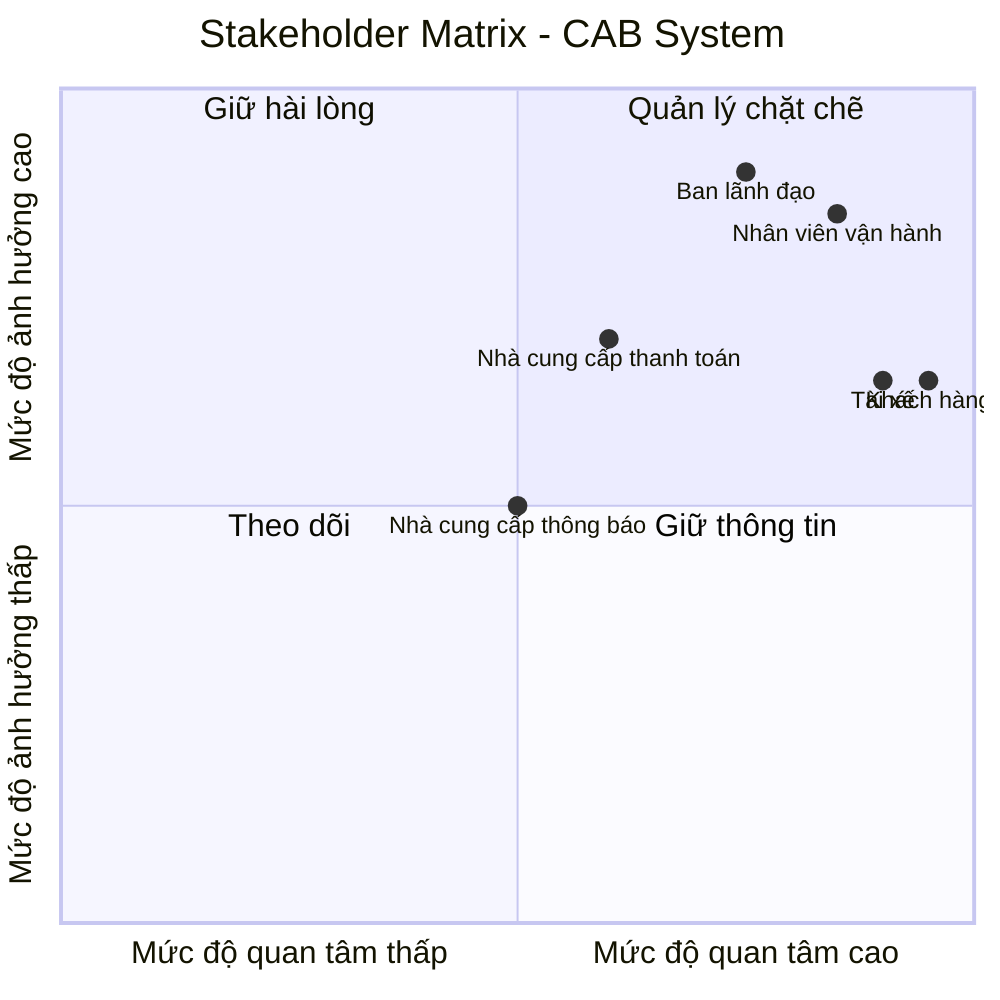
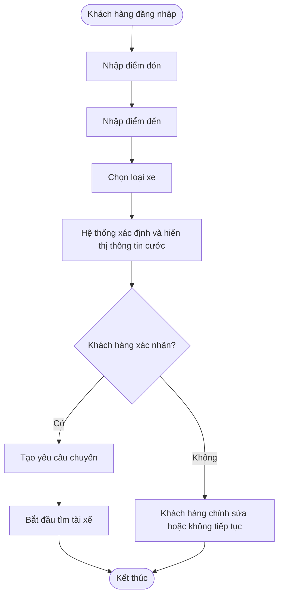
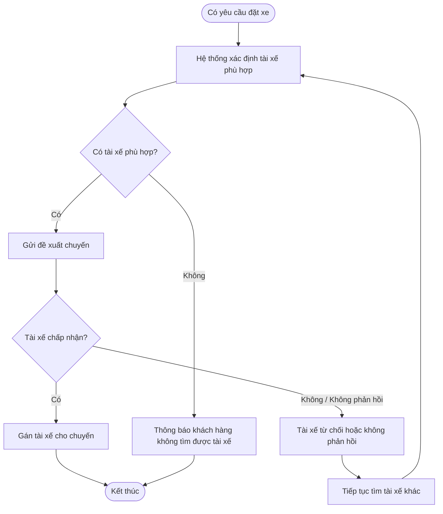
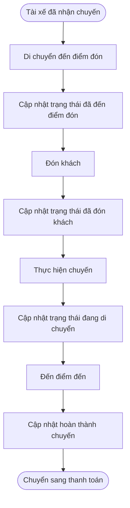
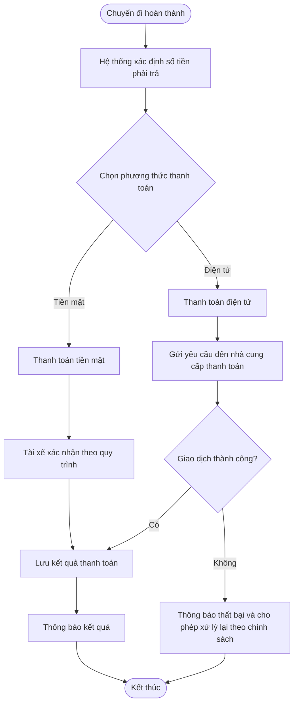
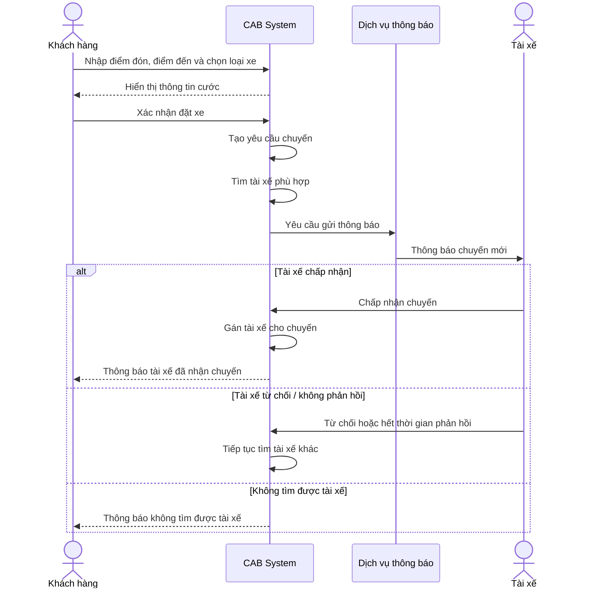
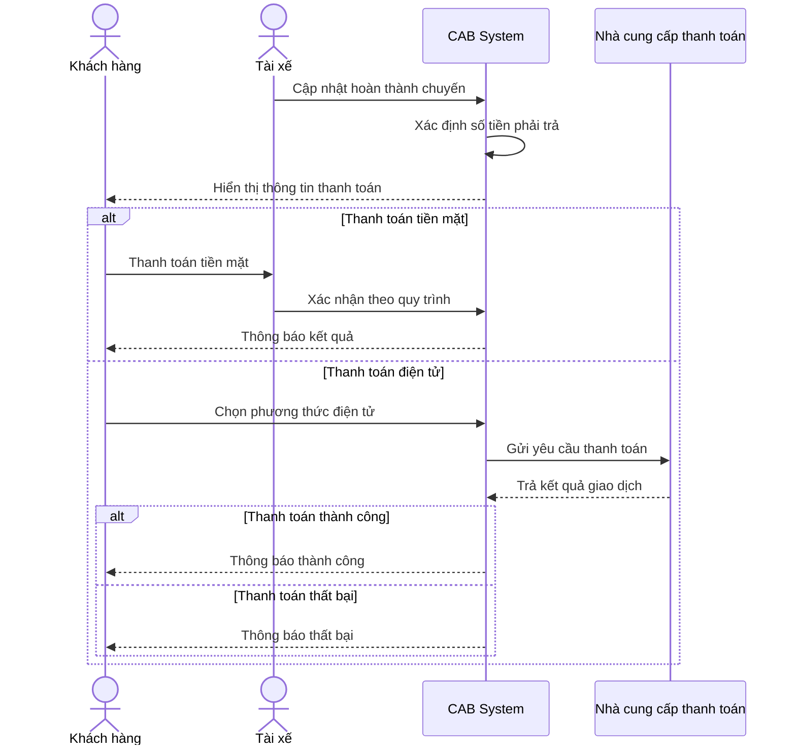
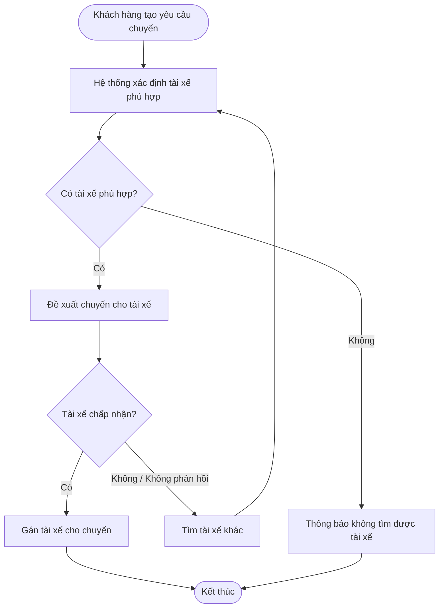
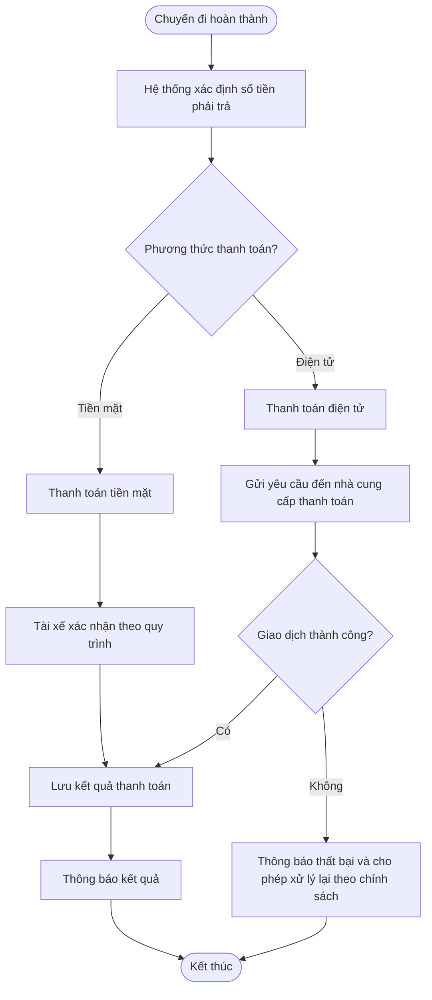

# 23632471_TranTuongVy_cabsystem
# Bước 1: Tìm hiểu nghiệp vụ của hệ thống

## 1.1. Bối cảnh và vấn đề hiện tại

Công ty ABC là doanh nghiệp cung cấp dịch vụ đặt xe trực tuyến. Hiện tại, khách hàng có thể liên hệ tổng đài hoặc sử dụng một ứng dụng đơn giản để yêu cầu xe.

Tuy nhiên, hệ thống hiện tại còn các hạn chế:

- Phân công tài xế chủ yếu được thực hiện thủ công.
- Khách hàng khó theo dõi trạng thái chuyến đi.
- Thông tin thanh toán chưa được quản lý tập trung.
- Bộ phận vận hành gặp khó khăn khi muốn mở rộng hệ thống.
- Hệ thống cần đáp ứng khả năng phục vụ số lượng lớn khách hàng và tài xế trong tương lai.

## 1.2. Mục tiêu xây dựng hệ thống

- Số hóa quy trình đặt xe từ khi khách hàng tạo yêu cầu đến khi hoàn thành chuyến.
- Tự động hóa việc tìm kiếm và phân công tài xế.
- Cho phép khách hàng theo dõi trạng thái chuyến đi và thông tin liên quan đến tài xế.
- Hỗ trợ tính cước và thanh toán bằng tiền mặt hoặc phương thức điện tử.
- Quản lý tập trung thông tin khách hàng, tài xế, phương tiện, chuyến đi và giao dịch.
- Hỗ trợ nhân viên vận hành theo dõi và xử lý các trường hợp chuyến đi gặp lỗi.
- Cung cấp báo cáo về số chuyến, doanh thu, tỷ lệ hoàn thành, tỷ lệ hủy và hiệu quả tài xế.
- Đảm bảo hệ thống có khả năng mở rộng, bảo mật và có thể phát triển thêm chức năng trong tương lai.

## 1.3. Lý do cần xây dựng hệ thống mới

Hệ thống hiện tại còn phụ thuộc nhiều vào thao tác thủ công, gây khó khăn trong việc phân công tài xế, theo dõi chuyến đi, quản lý thanh toán và mở rộng hoạt động.

Vì vậy, doanh nghiệp cần xây dựng một nền tảng CAB mới nhằm:

- Tự động hóa quy trình đặt xe.
- Quản lý dữ liệu tập trung.
- Nâng cao khả năng phục vụ khách hàng và tài xế.
- Hỗ trợ vận hành và quản lý hiệu quả hơn.
- Tạo nền tảng linh hoạt để phát triển lâu dài.

## 1.4. Các bên tham gia và sử dụng hệ thống

| Đối tượng | Vai trò |
|---|---|
| **Khách hàng** | Đăng ký, đăng nhập, cập nhật thông tin, đặt xe, theo dõi chuyến, xem lịch sử, thanh toán và đánh giá tài xế |
| **Tài xế** | Quản lý hồ sơ/phương tiện, cập nhật trạng thái hoạt động, nhận hoặc từ chối chuyến, cập nhật trạng thái và vị trí |
| **Nhân viên vận hành** | Quản lý khách hàng, tài xế, phương tiện, chuyến đi và hỗ trợ xử lý các trường hợp lỗi |
| **Ban lãnh đạo** | Xem báo cáo về hoạt động và kết quả kinh doanh |
| **Nhà cung cấp thanh toán** | Xử lý các giao dịch thanh toán điện tử |
| **Nhà cung cấp dịch vụ thông báo** | Hỗ trợ gửi thông báo cho khách hàng và tài xế |

## 1.5. Giá trị kinh doanh của hệ thống mới

- **Khách hàng:** Đặt xe thuận tiện, theo dõi trạng thái chuyến và thanh toán dễ dàng.
- **Tài xế:** Nhận thông báo chuyến phù hợp và quản lý hoạt động thuận tiện hơn.
- **Nhân viên vận hành:** Quản lý tập trung các đối tượng và hỗ trợ xử lý sự cố.
- **Ban lãnh đạo:** Có dữ liệu để theo dõi hoạt động và hiệu quả kinh doanh.
- **Doanh nghiệp:** Giảm thao tác thủ công và tăng khả năng mở rộng hệ thống.

---

# Bước 2: Xác định Stakeholder và Vai trò

| STT | Stakeholder | Vai trò / Mối quan tâm |
|:---:|---|---|
| 1 | **Khách hàng** | Sử dụng dịch vụ đặt xe, theo dõi chuyến, thanh toán và đánh giá |
| 2 | **Tài xế** | Thực hiện chuyến xe, nhận/từ chối chuyến và cập nhật trạng thái |
| 3 | **Nhân viên vận hành** | Quản lý và hỗ trợ hoạt động của hệ thống |
| 4 | **Ban lãnh đạo** | Theo dõi hoạt động và sử dụng báo cáo phục vụ quản lý |
| 5 | **Nhà cung cấp thanh toán** | Hệ thống bên ngoài xử lý thanh toán điện tử |
| 6 | **Nhà cung cấp thông báo** | Hệ thống bên ngoài hỗ trợ gửi thông báo |

## Stakeholder Matrix

> **Lưu ý:** Mức độ quan tâm và ảnh hưởng trong ma trận là đánh giá của nhóm BA để phục vụ việc quản lý stakeholder.

---

# Bước 3: Xác định mục đích của các nghiệp vụ

| STT | Nghiệp vụ | Mục đích |
|:---:|---|---|
| 1 | **Quản lý tài khoản** | Cho phép khách hàng và tài xế sử dụng tài khoản để truy cập hệ thống |
| 2 | **Quản lý hồ sơ và phương tiện** | Lưu trữ và cập nhật thông tin khách hàng, tài xế và phương tiện |
| 3 | **Đặt xe** | Cho phép khách hàng tạo yêu cầu chuyến đi |
| 4 | **Tìm kiếm và phân công tài xế** | Tìm tài xế phù hợp và xử lý phản hồi của tài xế |
| 5 | **Quản lý chuyến đi** | Theo dõi tiến trình từ khi nhận chuyến đến khi hoàn thành |
| 6 | **Theo dõi vị trí và trạng thái** | Hỗ trợ theo dõi trạng thái chuyến và vị trí tài xế |
| 7 | **Tính cước và thanh toán** | Xác định số tiền và xử lý thanh toán |
| 8 | **Thông báo** | Thông báo các sự kiện quan trọng liên quan đến chuyến đi |
| 9 | **Quản lý vận hành** | Hỗ trợ quản lý và xử lý các trường hợp lỗi |
| 10 | **Tra cứu lịch sử và giao dịch** | Lưu trữ và tra cứu lịch sử chuyến/giao dịch |
| 11 | **Đánh giá dịch vụ** | Cho phép khách hàng đánh giá tài xế sau chuyến |
| 12 | **Báo cáo hoạt động** | Cung cấp thông tin phục vụ theo dõi hoạt động |

---

# Bước 4: Xác định phạm vi

Hệ thống cần đảm bảo thực hiện được quy trình đặt xe cơ bản:

**Bước 1:** Khách hàng đăng nhập hệ thống.

**Bước 2:** Khách hàng nhập điểm đón và điểm đến.

**Bước 3:** Hệ thống tính và hiển thị giá cước.

**Bước 4:** Khách hàng xác nhận đặt xe.

**Bước 5:** Hệ thống tìm tài xế phù hợp.

**Bước 6:** Tài xế nhận chuyến.

**Bước 7:** Khách hàng theo dõi trạng thái và vị trí tài xế.

**Bước 8:** Tài xế thực hiện chuyến và cập nhật trạng thái.

**Bước 9:** Tài xế hoàn thành chuyến.

**Bước 10:** Khách hàng thanh toán.

**Bước 11:** Hệ thống lưu lịch sử chuyến.

**Bước 12:** Khách hàng đánh giá tài xế.

---
*Đăng nhập → Đặt xe → Chọn loại xe → Xác nhận chuyến → Tài xế nhận chuyến → Theo dõi chuyến → Hoàn thành chuyến → Thanh toán → Xem lịch sử → Đánh giá tài xế.*
---
## Lộ trình 7 tuần 

| Tuần | Nội dung thực hiện | Kết quả cần đạt |
|:---:|---|---|
| **Tuần 1** | Phân tích yêu cầu, xác định phạm vi, thiết kế cơ sở dữ liệu và kiến trúc hệ thống. | Hoàn thiện yêu cầu, sơ đồ nghiệp vụ, cơ sở dữ liệu và thiết kế tổng thể. |
| **Tuần 2** | Xây dựng **Module Xác thực** và **Module Quản lý người dùng**. | Người dùng có thể đăng ký, đăng nhập, đăng xuất và được phân quyền. |
| **Tuần 3** | Xây dựng **Module Quản lý tài xế** và **Module Quản lý phương tiện**. | Tài xế có hồ sơ, phương tiện và trạng thái sẵn sàng nhận chuyến. |
| **Tuần 4** | Xây dựng **Module Quản lý đặt xe** và **Module Quản lý chuyến đi**. | Khách hàng có thể đặt xe và tài xế có thể nhận, cập nhật chuyến. |
| **Tuần 5** | Xây dựng **Module Quản lý bản đồ và định vị**. | Hiển thị vị trí, điểm đón, điểm đến và theo dõi vị trí tài xế. |
| **Tuần 6** | Xây dựng **Module Quản lý thanh toán**, **Module Lịch sử & Đánh giá** và **Module Quản trị hệ thống**. | Hoàn thành các chức năng thanh toán, lịch sử, đánh giá và quản trị cơ bản. |
| **Tuần 7** | Tích hợp toàn bộ module, kiểm thử, sửa lỗi và hoàn thiện hệ thống. | Hệ thống hoạt động hoàn chỉnh theo quy trình đặt xe trực tuyến cơ bản. |

# Bước 5: Xác định yêu cầu nghiệp vụ

## 5.1. Ma trận quy trình nghiệp vụ

| STT | Giai đoạn | Quy trình | Hoạt động chính | Tác nhân |
|:---:|---|---|---|---|
| 1 | Khởi tạo | Đăng ký / Đăng nhập | Tạo tài khoản và xác thực người dùng | Khách hàng, Tài xế |
| 2 | Khởi tạo | Kiểm soát truy cập | Kiểm soát quyền thực hiện chức năng | Hệ thống |
| 3 | Quản lý thông tin | Quản lý khách hàng | Cập nhật và quản lý thông tin khách hàng | Khách hàng, Nhân viên vận hành |
| 4 | Quản lý thông tin | Quản lý tài xế/phương tiện | Cập nhật hồ sơ, phương tiện và trạng thái hoạt động | Tài xế, Nhân viên vận hành |
| 5 | Đặt xe | Tạo yêu cầu chuyến | Nhập điểm đi/đến, chọn loại xe, xem thông tin cước | Khách hàng |
| 6 | Điều phối | Tìm tài xế | Xác định tài xế phù hợp | Hệ thống |
| 7 | Điều phối | Xử lý phản hồi | Tài xế chấp nhận, từ chối hoặc không phản hồi | Tài xế, Hệ thống |
| 8 | Thực hiện | Cập nhật chuyến | Cập nhật các trạng thái trong quá trình thực hiện | Tài xế |
| 9 | Theo dõi | Theo dõi chuyến | Hiển thị trạng thái và thông tin vị trí | Khách hàng, Nhân viên vận hành |
| 10 | Thanh toán | Xử lý thanh toán | Tiền mặt hoặc thanh toán điện tử | Khách hàng, Tài xế, Nhà cung cấp thanh toán |
| 11 | Thông báo | Gửi thông báo | Thông báo các sự kiện quan trọng | Hệ thống, Nhà cung cấp thông báo |
| 12 | Sau chuyến | Lịch sử và đánh giá | Lưu lịch sử, tra cứu và đánh giá | Khách hàng, Nhân viên vận hành |
| 13 | Vận hành | Hỗ trợ xử lý lỗi | Theo dõi và hỗ trợ các trường hợp lỗi | Nhân viên vận hành |
| 14 | Báo cáo | Báo cáo hoạt động | Tổng hợp thông tin phục vụ quản lý | Ban lãnh đạo |

## 5.2. Business Requirements

| Mã | Yêu cầu nghiệp vụ |
|---|---|
| **BR-01** | Người dùng phải được xác thực trước khi sử dụng các chức năng yêu cầu tài khoản; thao tác quản trị phải được kiểm soát quyền truy cập |
| **BR-02** | Hệ thống hỗ trợ quản lý thông tin khách hàng, tài xế và phương tiện |
| **BR-03** | Khách hàng có thể tạo yêu cầu bằng điểm đón, điểm đến và lựa chọn loại xe |
| **BR-04** | Hệ thống xác định thông tin cước theo loại dịch vụ và thông tin chuyến đi |
| **BR-05** | Hệ thống tìm và đề xuất tài xế phù hợp dựa trên vị trí, trạng thái sẵn sàng và tiêu chí vận hành |
| **BR-06** | Tài xế có thể chấp nhận/từ chối chuyến và cập nhật trạng thái |
| **BR-07** | Khách hàng có thể theo dõi trạng thái chuyến và thông tin liên quan đến tài xế |
| **BR-08** | Hệ thống hỗ trợ thanh toán tiền mặt hoặc thanh toán điện tử thông qua nhà cung cấp bên ngoài |
| **BR-09** | Hệ thống gửi thông báo về các sự kiện quan trọng của chuyến và thanh toán |
| **BR-10** | Hệ thống lưu lịch sử chuyến và cho phép khách hàng đánh giá tài xế sau chuyến |
| **BR-11** | Hệ thống hỗ trợ quản lý vận hành và cung cấp báo cáo hoạt động |

---

# Bước 6: Phân rã các yêu cầu chức năng

| Mã FR | Chức năng | Mô tả |
|:---:|---|---|
| **FR-01** | Quản lý tài khoản | Đăng ký, đăng nhập và cập nhật thông tin tài khoản |
| **FR-02** | Quản lý khách hàng | Xem và cập nhật thông tin khách hàng |
| **FR-03** | Quản lý tài xế và phương tiện | Cập nhật hồ sơ, phương tiện và trạng thái hoạt động |
| **FR-04** | Tạo yêu cầu đặt xe | Nhập điểm đón/đến, chọn loại xe và xác nhận yêu cầu |
| **FR-05** | Hiển thị thông tin cước | Xác định và hiển thị thông tin cước theo chính sách được xác nhận |
| **FR-06** | Tìm và điều phối tài xế | Tìm tài xế phù hợp và tiếp tục tìm khi tài xế không nhận chuyến |
| **FR-07** | Quản lý chuyến đi | Nhận/từ chối chuyến và cập nhật trạng thái chuyến |
| **FR-08** | Theo dõi chuyến | Hiển thị trạng thái chuyến và thông tin vị trí tài xế |
| **FR-09** | Thanh toán | Xử lý tiền mặt hoặc thanh toán điện tử |
| **FR-10** | Thông báo | Gửi thông báo cho khách hàng và tài xế |
| **FR-11** | Lịch sử và đánh giá | Xem lịch sử chuyến/giao dịch và đánh giá tài xế |
| **FR-12** | Quản lý vận hành | Quản lý các đối tượng và hỗ trợ xử lý lỗi |
| **FR-13** | Báo cáo | Xem các chỉ số hoạt động theo yêu cầu |

---

# Bước 7: Vẽ Use Case Diagram

> Mermaid không hỗ trợ đầy đủ hình thức Use Case Diagram chuẩn UML. Sơ đồ dưới đây được dùng để thể hiện các tác nhân và Use Case chính trên GitHub.

```mermaid
flowchart LR

    KH[👤 Khách hàng]
    TX[🚗 Tài xế]
    NV[💼 Nhân viên vận hành]
    LD[📊 Ban lãnh đạo]
    PAY[💳 Nhà cung cấp thanh toán]
    NOTI[🔔 Nhà cung cấp thông báo]

    subgraph CAB["🚕 CAB SYSTEM"]

        UC1([Đăng ký / Đăng nhập])
        UC2([Quản lý thông tin])

        UC3([Đặt xe])
        UC4([Xem thông tin cước])
        UC5([Tìm và phân công tài xế])

        UC6([Nhận / Từ chối chuyến])
        UC7([Cập nhật trạng thái chuyến])
        UC8([Theo dõi chuyến])

        UC9([Thanh toán])
        UC10([Nhận thông báo])

        UC11([Xem lịch sử])
        UC12([Đánh giá tài xế])

        UC13([Quản lý vận hành])
        UC14([Xem báo cáo])
    end

    KH --- UC1
    KH --- UC2
    KH --- UC3
    KH --- UC4
    KH --- UC8
    KH --- UC9
    KH --- UC10
    KH --- UC11
    KH --- UC12

    TX --- UC1
    TX --- UC2
    TX --- UC6
    TX --- UC7
    TX --- UC10

    NV --- UC13
    LD --- UC14

    PAY --- UC9
    NOTI --- UC10

    UC3 --> UC4
    UC3 --> UC5
    UC5 --> UC6
    UC6 --> UC7
    UC7 --> UC8
```

---

# Bước 8: Đặc tả Use Case

## 8.1. UC-01 – Đặt xe

### Thông tin chung

| Thuộc tính | Nội dung |
|---|---|
| **Use Case ID** | UC-01 |
| **Tên Use Case** | Đặt xe |
| **Tác nhân chính** | Khách hàng |
| **Mục tiêu** | Tạo yêu cầu chuyến đi |
| **Tiền điều kiện** | Khách hàng đã được xác thực |
| **Hậu điều kiện** | Yêu cầu chuyến được tạo và chuyển sang quá trình tìm tài xế |

### Luồng Use Case

---

## 8.2. UC-02 – Tìm và phân công tài xế

### Thông tin chung

| Thuộc tính | Nội dung |
|---|---|
| **Use Case ID** | UC-02 |
| **Tên Use Case** | Tìm và phân công tài xế |
| **Tác nhân chính** | Hệ thống |
| **Tác nhân liên quan** | Tài xế, Khách hàng |
| **Mục tiêu** | Tìm tài xế phù hợp cho chuyến |
| **Tiền điều kiện** | Yêu cầu chuyến đã được tạo |
| **Hậu điều kiện** | Có tài xế nhận chuyến hoặc khách hàng được thông báo không tìm được tài xế |

### Luồng Use Case

> **Lưu ý:** Thời gian cụ thể để xác định “không phản hồi” cần được xác nhận với khách hàng.

---

## 8.3. UC-03 – Thực hiện chuyến đi

### Thông tin chung

| Thuộc tính | Nội dung |
|---|---|
| **Use Case ID** | UC-03 |
| **Tên Use Case** | Thực hiện và cập nhật chuyến |
| **Tác nhân chính** | Tài xế |
| **Tác nhân liên quan** | Khách hàng |
| **Tiền điều kiện** | Tài xế đã nhận chuyến |
| **Hậu điều kiện** | Chuyến được hoàn thành và chuyển sang thanh toán |

### Luồng Use Case

---

## 8.4. UC-04 – Thanh toán

### Thông tin chung

| Thuộc tính | Nội dung |
|---|---|
| **Use Case ID** | UC-04 |
| **Tên Use Case** | Thanh toán |
| **Tác nhân chính** | Khách hàng |
| **Tác nhân phụ** | Tài xế, Nhà cung cấp thanh toán |
| **Tiền điều kiện** | Chuyến đi đã hoàn thành |
| **Hậu điều kiện** | Kết quả thanh toán được lưu và thông báo |

### Luồng Use Case

---

# Bước 9: Phân tích quy trình nghiệp vụ

## 9.1. Sequence Diagram – Đặt xe và điều phối tài xế

---

## 9.2. Sequence Diagram – Hoàn thành chuyến và thanh toán

---

# Bước 10: Phân tích quy tắc nghiệp vụ

## 10.1. Business Rule – Điều phối tài xế

### Các quy tắc được thể hiện

- Chỉ tài xế phù hợp mới được đề xuất chuyến.
- Khi tài xế từ chối hoặc không phản hồi, hệ thống tiếp tục tìm tài xế khác.
- Khách hàng không cần tạo lại yêu cầu.
- Nếu không tìm được tài xế, hệ thống phải thông báo cho khách hàng.

---

## 10.2. Business Rule – Thanh toán

## 10.3. Danh sách Business Rules

| Mã | Business Rule |
|---|---|
| **RULE-01** | Khách hàng và tài xế phải được xác thực trước khi sử dụng các chức năng yêu cầu tài khoản |
| **RULE-02** | Các thao tác quản trị phải được kiểm soát quyền truy cập |
| **RULE-03** | Tài xế được đề xuất chuyến phải đáp ứng các điều kiện phù hợp về vị trí, trạng thái sẵn sàng và tiêu chí vận hành |
| **RULE-04** | Khi tài xế từ chối hoặc không phản hồi, hệ thống tiếp tục tìm tài xế khác |
| **RULE-05** | Nếu không tìm được tài xế, khách hàng phải được thông báo rõ ràng |
| **RULE-06** | Tài xế cập nhật trạng thái chuyến trong quá trình thực hiện |
| **RULE-07** | Số tiền thanh toán được xác định dựa trên loại dịch vụ và thông tin chuyến đi theo chính sách doanh nghiệp |
| **RULE-08** | Hệ thống hỗ trợ thanh toán bằng tiền mặt hoặc phương thức điện tử |
| **RULE-09** | Hệ thống CAB không lưu trực tiếp thông tin nhạy cảm của thẻ hoặc tài khoản thanh toán |
| **RULE-10** | Khi thanh toán điện tử thất bại, hệ thống thông báo và cho phép xử lý lại theo chính sách |
| **RULE-11** | Hệ thống gửi thông báo về các sự kiện quan trọng liên quan đến chuyến và thanh toán |
| **RULE-12** | Khách hàng đánh giá tài xế sau khi chuyến đi hoàn thành |
| **RULE-13** | Dữ liệu cá nhân, phương tiện, vị trí và giao dịch phải được bảo vệ |
| **RULE-14** | Các thao tác quan trọng cần được lưu vết phục vụ kiểm tra khi xảy ra sự cố |

## 10.4. Các điểm BA cần xác nhận

| Mã | Nội dung cần xác nhận |
|---|---|
| **OPEN-01** | Công thức và các thành phần cụ thể để tính cước |
| **OPEN-02** | Tiêu chí ưu tiên giữa các tài xế phù hợp |
| **OPEN-03** | Thời gian tối đa tài xế được phép phản hồi |
| **OPEN-04** | Chính sách và điều kiện hủy chuyến |
| **OPEN-05** | Cách xử lý khi khách hàng hoặc tài xế mất kết nối |
| **OPEN-06** | Thời gian và chính sách lưu trữ dữ liệu |

> **Ví dụ:** Không nên tự đặt quy tắc “luôn ưu tiên tài xế có rating cao nhất” vì khách hàng chưa chốt tiêu chí ưu tiên cụ thể.

---
